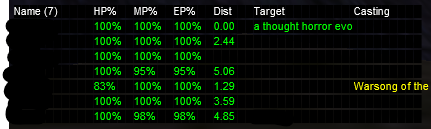

# MQ2HUD

This script can be used to generate a similar boxing HUD for the MQ2HUD plugin which pulls data from MQ2EQBC and the MQ2NetBots plugin.

```
bash generate_hud.sh -x <x_offset> -y <y_offset> -n <num_clients>
```

- *x_offset*: The initial X offset the HUD should begin from. Default: 70
- *y_offset*: The initial Y offset the HUD should begin from. Default: 190
- *num_clients*: The maximum number of clients the HUD should be configured to display. Default: 24

Example:



Can't take all the credit for this one. Its a combination of various examples found across forums and tweaked to my playstyle.
