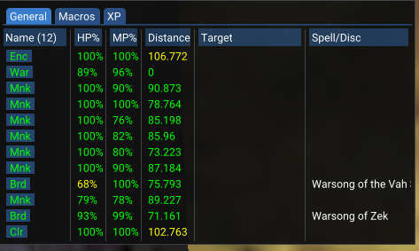
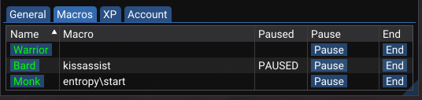
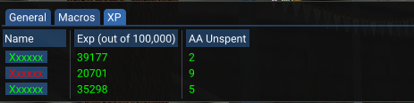
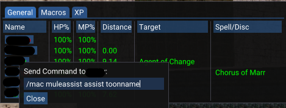

# boxhud

A Lua / ImGui boxing HUD for EverQuest.

# Requirements

- MQNext
- MQ2Lua
- Either or both of:
  - MQ2DanNet (to use DanNet peers/observers)
  - MQ2EQBC+MQ2NetBots (to use netbots data)

# Installation

Add `boxhud.lua` and `boxhud-settings.lua` to the `lua` folder of your MQ directory.

# Usage

Run the script with:

```
/lua run boxhud
```

Stop the script with:
```
/boxhudend
```
or
```
lua stop boxhud
```

Toggle the window with:

```
/boxhud
```

# Overview

BoxHUD provides an alternative to a similar [MQ2NetBots/MQ2HUD based HUD](MQ2HUD/README.md). Instead, it uses observed properties from MQ2DanNet to watch various bits of information about all your peers. It is also still possible to use MQ2NetBots values if desired.

The default settings provided Includes the following properties:

General tab:
- Name -- in green if in same zone as the character running the script, in ( ) if invis, in red if not in same zone
- HP% -- with % threshold based coloring, red < 35, yellow < 70, green > 70
- Mana% -- with % threshold based coloring, red < 35, yellow < 70, green > 70.
- Endurance% -- with % threshold based coloring, red < 35, yellow < 70, green > 70.
- Distance -- if character is in same zone, displays distance away from the character, green if dist < 100, yellow < 200, red > 200
- Target -- if character is in same zone, name of their target
- Spell/Disc -- name of spell currently being cast or current running disc

Macro tab:
- Macro Name -- the name of the currently running macro
- Paused -- shows PAUSED if the currently running macro is paused
- Pause macro button -- sends `/dex name /mqp` to the character
- End macro button -- sends `/dex name /end` to the character

XP tab:
- Exp% -- current level experience percentage
- AA Unspent -- current number of unspent AAs

Additionally, the character names are buttons with the following function:
- Left click -- Brings the character to the foreground with `/dex toonname /foreground`.
- Right click -- Opens a context menu with some helpful buttons specific to the selected toon. Also includes a `Send Command` text input which will do `/dex toonname <text input>`

These button actions are more just to play around with the capabilities we have now with an interactive window like this. 

Example:









The script takes a few seconds to start up as it waits for the DanNet observers to be ready.
Characters which log off or for some reason stop being available will go stale and be removed from the table after 30 seconds.

# Configuration
The configuration is stored in a separate Lua file, which is then included with `settings = require('boxhud-settings')`.

By default, `boxhud-settings.lua` is included with the script. Upon startup, it will be copied to a character specific file `boxhud-settings-charactername.lua`.
An existing `boxhud-settings-charactername.lua` will always take precedence over `boxhud-settings.lua`.
A settings filename can also be provided when starting the script like `lua run boxhud boxhud-settings.lua`

Note that since the settings are another lua file, its expecting the settings file to also be in the lua folder, rather than the config folder.

## Columns
Columns can have two types, `property` or `button`.

### Property Columns
Each property column includes several settings, for example:

```
        {
            Name='MP%',
            Type='property'
            Properties={caster='Me.PctMana',melee='Me.PctEndurance'},
            Thresholds={35,70},
            Percentage=true,
            Ascending=true,
            InZone=false,
            Width=40
        },
```

Each column lists the observed property or properties which it uses to populate its data.
More details on each setting can be found in the provided `boxhud-settings.lua`.
Note that the `Name` column is treated as a special case.

### Button Columns
Each button column includes several settings, for example:

```
        {
            Name='Pause',
            Type='button',
            Action='/dex #botName# /mqp',
            Width=50
        },
```

The button `Action` supports replacement of the string `#botName#` with the name of the character in the row where the button exists.

## Tabs
Each tab includes a name and list of columns to be included in that tab, for example:

```
    {
        Name='General',
        Columns={
            {
                Name='HP%',
                ...
            }
        }
    },
```

## ObservedProperties
Each observed property must be in the `ObservedProperties` list.
The following properties are observed for the Name column, which is handled separately from the rest:
- *Me.Class.ShortName*

## SpawnProperties
Columns may refer to spawn data, defined in `SpawnProperties`. Spawn data will be based on `${Spawn[observed character id].PropertyName}`

## NetBotsProperties
Columns may refer to MQ2NetBots properties as well.

Some other configuration options include:

## PeerGroup
This can be set to **all** or **zone** to use either the DanNet All peer group or the zone specific peer group.
**Default**: zone

## RefreshInterval
Configure the delay for polling observed properties. Used in `mq.delay()` call.
**Default**: 250 (0.25 seconds)

## StaleDataTimeout
Configure the time in seconds before stale entries are removed from the displayed data.
**Default**: 60

# Extra notes:
- I'm far from (read: not at all) a Lua expert, so don't be too surprised if any Lua best practices haven't been followed here or things could be done in much more clean ways.
- I'm open to suggestions / improvements :)
- This is mostly just written as me wanting to explore some of the possibilities provided by the new Lua support
- This is still very much a work in progress
